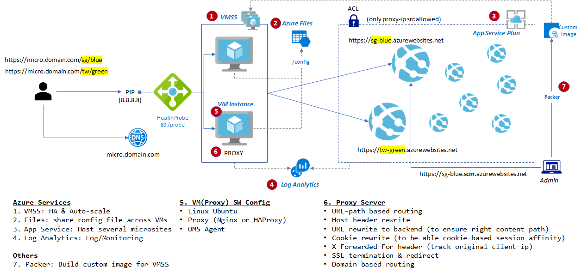

# Proxy server for Azure App Service

When you're managing 100s microsites on Azure App Service you're facing with management overheads with too many domain names

You can simplify or centralize domain name (+ SSL offload) and route by path with reverse proxy server.
Following is the architecture for this solution.

## Proxy server config

Proxy server does following tasks

- URL-path based routing
- Host header rewrite
- URL rewrite to backend (to ensure right content path)
- Cookie rewrite (to be able cookie-based session affinity)
- X-Forwarded-For header (track original client-ip)
- SSL termination & redirect
- Domain based routing

For more information, see [NGINX config sample](./nginx)

## Packer Script

You may want to simplify managing multiple VM instances and enable better monitoring. That is,

- Mount a shared folder(azure files) on confg folder like `/config` for simplifying managing multiple VM instances
- Install & config OMSAgent and CollectD to send NGINX perf logs to Log Analytics via OMSAgent

You could setup/configure manually but you would better to automate and VM imaging using Packer.

For how to create packer script, see [Packer script sample](./packer)

## VMSS

VMSS is recommended for HA and Autoscale.

For how to provision with VMSS, see [VMSS script sample](./vmss)